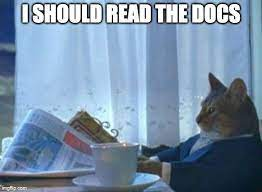

# lab-apis

# Challenge-1
In this challenge, you will:

- Read the docs
- Do one request to an API
- Do many requests in a loop to an API
- Create a function that does the request
- Create a dataframe using that function
- Transforming that dataframe

# Challenge-2

In this challenge, you will:

- Read the docs
- Do requests with parameters
- Create a function that takes arguments to do the requests
- Use the `bible.csv`. On which you will use the function you created. You will pass that function to a column to get a new column.

# Challenge-3

In this challenge you will

